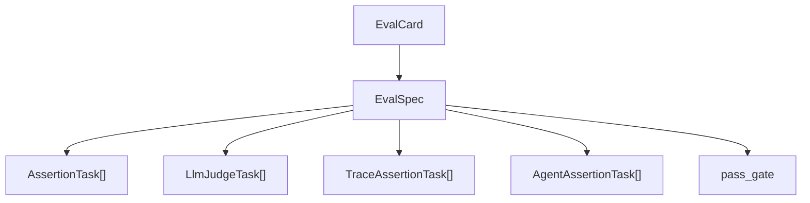
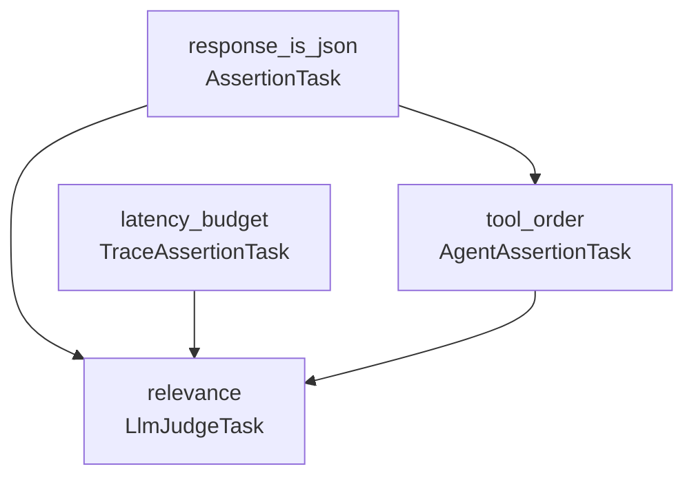

# EvalCard and tasks

## The evaluation unit: EvalCard

An `EvalCard` is the registered evaluation unit. It uses the same Card envelope
as every other Wyrd kind: `apiVersion`, `metadata`, `kind: Eval`, `spec`,
server-derived `relationships`, and server-managed `status`.

Identity is the standard Wyrd `(space, name, version)` triple. The `EvalSpec`
does not carry identity itself; it declares the subject, dataset, task DAG,
workflow hint, sampling policy, pass gate, and context-capture policy. See
[Cards](/concepts/card/) for the envelope model and [Eval card
reference](/cards/eval/) for the generated schema.



## Four task kinds

Each task kind checks a different part of an agent run. The deterministic task
kinds are cheap enough to run first. `LlmJudgeTask` is intentionally last in
most DAGs because it calls a judge model.

| Task kind | What it checks | Cost | Latency |
|---|---|---|---|
| `AssertionTask` | Values in `ExecutionContext` such as structure, thresholds, and formats | Zero | Microseconds, pure Rust |
| `LlmJudgeTask` | Semantic quality through an LLM judge, such as relevance, faithfulness, and tone | One LLM call per record | Provider-dependent |
| `TraceAssertionTask` | OTel span properties such as order, duration, retries, and tokens | Zero | Microseconds |
| `AgentAssertionTask` | Agent tool calls and response structure through a vendor-agnostic workflow envelope | Zero | Microseconds |

## AssertionTask

`AssertionTask` extracts a value from the execution context and applies a
`ComparisonOperator`. The runtime uses JSONPath helpers such as
`extract_jsonpath_from` and `extract_required_jsonpath_from`; missing optional
paths resolve differently from required paths so a task can distinguish absent
data from a failed comparison.

The operator set has more than fifty variants covering equality, numeric
thresholds, ranges, string matching, regular expressions, collection checks,
length checks, type checks, JSON validation, tolerances, divergence, and vector
similarity. Use it for format checks, schema-like constraints, thresholds,
ground-truth comparisons, and cheap gates before a judge task.

```yaml
tasks:
  response_is_json:
    kind: assertion
    id: response_is_json
    context_path: "$.response"
    operator: is_json
    expected: true
```

## LlmJudgeTask

`LlmJudgeTask` links to a registered `Prompt` card through `judge_ref`. The
runtime renders the judge prompt with the selected context, dispatches it
through the approved Skald runtime boundary, and compares the structured judge
response with the declared `operator` and `expected` value.

Production runs use `SkaldJudgeInvoker`. Tests and credential-free CI use
`MockJudgeInvoker`, exposed by the CLI through `--judge-mock`. That flag is
required when the spec contains judge tasks and no real judge provider should
be called.

## TraceAssertionTask

`TraceAssertionTask` asserts over the assembled OpenTelemetry trace document.
The task's `span_selector` picks a scalar, span list, or subtree from the trace
view, then applies the same `ComparisonOperator` model. Use it for span order,
retry limits, latency thresholds, token budgets, error spans, and required
instrumentation. See [Observability](/observability/) for the trace and
observation side of the platform.

## AgentAssertionTask

`AgentAssertionTask` asserts over the assembled agent workflow envelope. It is
the deterministic tool-call and response-structure task kind: tool present,
tool arguments, call order, response fields, finish reason, model, or token
budget. Vendor-specific response parsing stays behind the executor layer; task
definitions stay Wyrd-native.

## Dependency DAGs and conditional gates

Every task can declare `depends_on`. Wyrd validates the task graph as a DAG and
builds an execution plan. Tasks in the same stage can run independently; later
stages receive scoped access to declared dependency outputs.

Every task can also carry an `EvalCondition`. Conditions use JSONPath,
`ComparisonOperator`, and optional `and` / `or` chaining. This is the locked
v1 gate shape: a condition decides whether the task runs. Downstream tasks that
depend on a skipped task do not receive a result for that dependency.



The common pattern is cheap-first: structural assertions and trace checks run
before judge calls. If the required shape is missing, the expensive semantic
judge does not burn tokens on an unusable record.

## Pass gates and exit codes

`EvalSpec.pass_gate` is the run-level criterion Wyrd applies after
aggregation. The current gate shapes include overall pass rate,
per-judge pass rate, and all-pass. The aggregate verdict is written as
`pass_gate_verdict` in `EvalResults`.

The CLI maps that verdict to process status. A satisfied gate exits `0`. A
failed gate exits `2` when `--fail-on-gate` is enabled, which is the default
for local result-producing flows.
