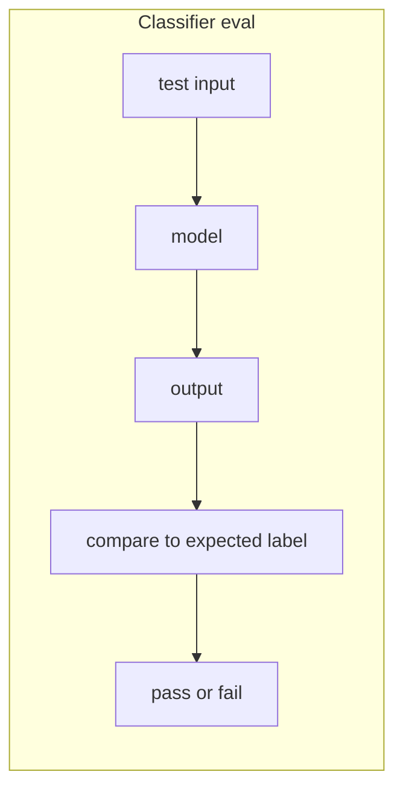
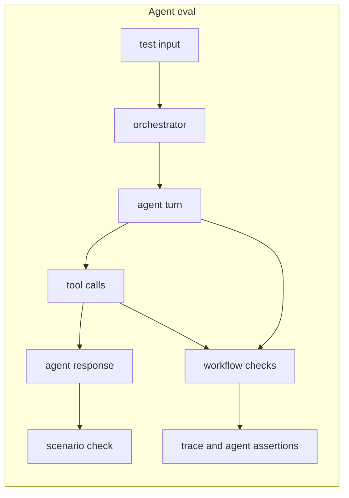

# Evaluation

Wyrd evaluation gives agent teams a registered, repeatable way to test whether
agent behavior still meets the declared quality bar. The unit is an `EvalCard`.
The runtime executes scenarios, collects `EvalRecord` evidence, scores that
evidence through task definitions, and emits `EvalResults` that can be compared
against a saved baseline.

## Agents aren't models

A classifier takes an input and returns an output. You can compare that output
to a label and get a stable answer. An agent takes an input, decides whether to
call tools, may hand work to another declared component, carries conversation
history across turns, and finally returns a response shaped by all of those
intermediate choices.

That makes exact-output tests brittle. Two successful runs can produce
different wording, token counts, tool order, or trace shape. A failed run can
look acceptable if the final response happens to be right while the path was
expensive, fragile, or missing a required tool call.

Wyrd treats these as separate signals. The scenario view asks whether the agent
got the user from start to finish. The workflow view asks whether the declared
run stayed healthy underneath: span order, retries, token use, tool calls,
structured fields, and judge scores.

External dependencies make this more important. Provider changes, tool API
changes, prompt updates, and context-window limits can all change behavior
without changing the `EvalCard`. A useful evaluation surface has to catch both
pre-deploy regressions and production-sampling regressions with the same task
definitions.

## Scope of the evaluation problem

Agent evaluation is not one check. It spans prompt-level assertions,
single-agent task quality, multi-turn session quality, and workflow-level
health across traces and tool calls.

The first split is single-agent versus multi-agent or multi-component
pipelines. A single agent may only need scenario outcomes and a few workflow
checks. A pipeline may need the same end-to-end scenario plus per-subject task
results so one degraded component does not hide behind a passing final answer.

The second split is prompt-level versus session-level behavior. A prompt-level
check can assert that a response is JSON, contains required fields, or stays
under a threshold. A session-level check needs a `Scenario`, conversation
history, termination behavior, and scoring across the full interaction.

The third split is scenario versus workflow. Scenario tasks are the outside
view: given this scenario, did the interaction pass? Workflow tasks are the
inside view: did the run call the right tools, emit the right spans, and meet
the declared structural checks? Wyrd runs both views in one evaluation run.

## What Wyrd ships

- `EvalCard` and `EvalSpec`: the registered, versioned evaluation unit.
- Four `EvalTask` kinds: `AssertionTask`, `LlmJudgeTask`,
  `TraceAssertionTask`, and `AgentAssertionTask`.
- `Scenario` and the turn protocol: multi-turn agent runs with scripted,
  server-simulated, or client-delegated user turns.
- `EmbeddedOrchestrator`: the in-process engine for local CLI runs.
- `vala-http::eval` routes: the turn-protocol HTTP surface mounted under
  `wyrd-server`.
- `wyrd eval run`: the CLI entry for local runs, record replay, and server
  protocol runs.
- `wyrd.eval.run_eval`: the Python protocol client for driving a server run
  from a Python callable.
- `EvalResults` and `ComparisonResults`: run summaries, pass-gate verdicts, and
  four-quadrant baseline diffs.

## Why it matters

Unit tests catch code-level failures. They do not catch quality regressions
caused by a model update, a tool returning a subtly different shape, a prompt
template drifting, or a retriever span running too slowly. Those failures are
production-blocking for agents because the final response is only one part of
the behavior users depend on.

Notebook-grade evaluation usually starts as a good prototype and then becomes
operational debt. Wyrd lets the same declared task definitions gate CI,
exercise local scenarios, replay captured records, and compare production
samples to a known baseline. The point is not a new scoring script. The point
is one versioned evaluation contract that Wyrd can inspect, run, and compare.

## Where to go next

- [EvalCard and tasks](/evaluation/eval-card-and-tasks/) explains the
  registered unit, the four task kinds, and task DAGs.
- [Scenarios and records](/evaluation/scenarios-and-records/) explains the
  runtime units and turn protocol.
- [Running evals](/evaluation/running-evals/) shows the three CLI flows.
- [Results and comparison](/evaluation/results-and-comparison/) covers
  `EvalResults`, pass gates, and baseline diffs.
- [Python SDK](/evaluation/python-sdk/) documents `wyrd.eval.run_eval`.
- [Comparison](/evaluation/comparison/) positions Wyrd against adjacent tools.
- [Discussion](/evaluation/discussion/) records v1 tradeoffs and followups.
