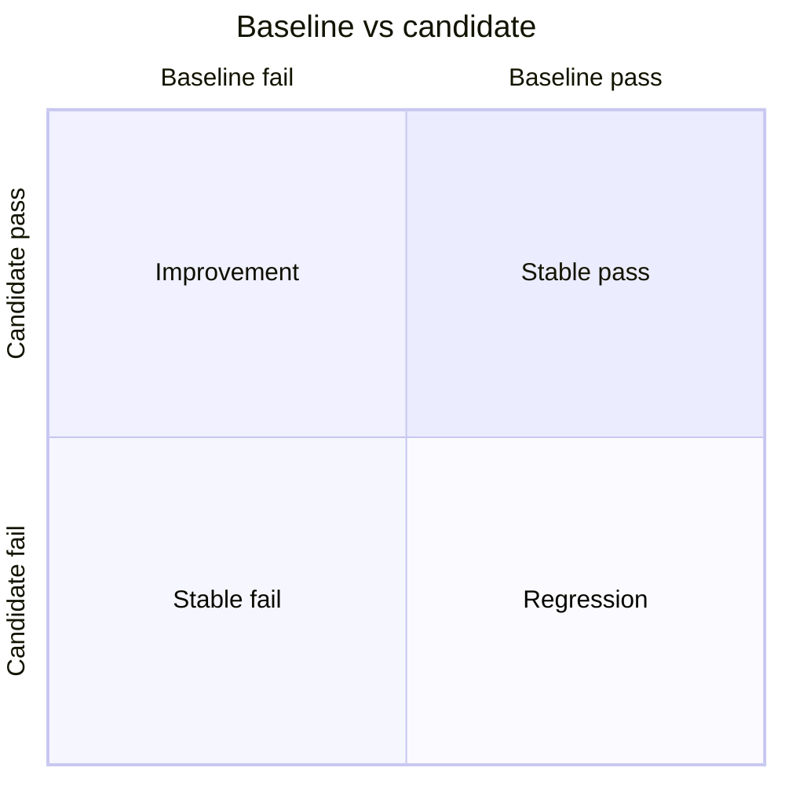

# Results and comparison

## EvalResults shape

`EvalResults` is the top-level artifact emitted at the end of a local eval run.
It carries run identity, per-scenario results, per-subject rollups, run-level
metrics, an optional pass-gate verdict, and the aggregation config used to
produce the artifact.

```json
{
  "identity": {
    "run_id": "018f5f54-0000-7000-8000-000000000001",
    "eval_ref": { "kind": "Eval", "name": "support-eval", "version": "1.0.0" },
    "started_at": "2026-06-11T12:00:00Z",
    "ended_at": "2026-06-11T12:00:05Z"
  },
  "metrics": {
    "total_tasks": 8,
    "passed_tasks": 7,
    "pass_rate": 0.875,
    "total_scenarios": 2,
    "passed_scenarios": 2,
    "scenario_pass_rate": 1.0
  },
  "pass_gate_verdict": {
    "passed": true,
    "observed": 0.875,
    "threshold": 0.8,
    "reason": "overall pass rate satisfied"
  }
}
```

Scenario results include mechanic-view task outputs grouped by subject,
passenger-view scenario task summaries, captured conversation history,
scenario pass/fail, start time, and duration. Subject results include the full
subject `CardRef`, per-task assertion rows, and subject metrics.

## Pass gates

`EvalSpec.pass_gate` becomes `pass_gate_verdict` during aggregation. The
verdict records the gate, whether it passed, the observed value, the threshold,
and a human-readable reason.

The CLI maps a failed local pass gate to exit code `2` by default. A missing
pass gate is treated as satisfied for process-status purposes.

## Four-quadrant comparison

The comparison engine compares a baseline `EvalResults` artifact with a
candidate `EvalResults` artifact. It reports subject deltas, scenario
transitions, system aggregate deltas, and cross-cutting per-task deltas.

| Term | Meaning |
|---|---|
| `stable_pass` | Baseline and candidate both pass the configured cutoff |
| `stable_fail` | Baseline and candidate both fail the configured cutoff |
| `regression` | Candidate drops below the baseline by more than the threshold |
| `improvement` | Candidate rises above the baseline by more than the threshold |



## Baselines

A baseline is a verbatim `EvalResults` JSON file. There is no extra wrapper.
A common layout is:

```text
./eval-baselines/support-eval@1.0.0.json
```

Refresh a baseline by rerunning the eval with `--out`, reviewing the result,
and replacing the saved JSON only when the candidate is the new accepted bar.

## Reading the JSON

In `comparison.json`, `baseline_run_id` and `candidate_run_id` identify the
two runs. `subjects` contains per-subject aggregate and per-task deltas for
subjects present in both runs. `scenarios` records scenario pass/fail
transitions. `system` records run-level pass-rate and scenario-rate deltas.
`cross_cutting_task_deltas` reports task changes across all subjects.

Absence lists are explicit: subjects or scenarios present on only one side are
not silently folded into a pass-rate delta. `regressed_subjects` and
`improved_subjects` are convenience lists for CI and dashboards.

## Regression policy

The comparison artifact says what changed. The caller owns the policy decision
about whether to block a release. Most CI flows combine the process exit code
from the pass gate with a small script that reads `comparison.json` and fails
on unacceptable regressions.
