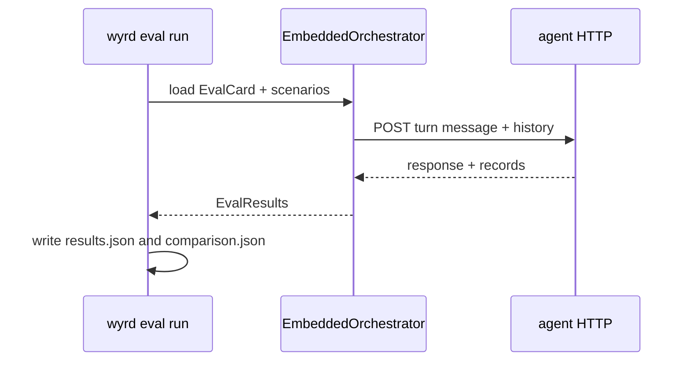
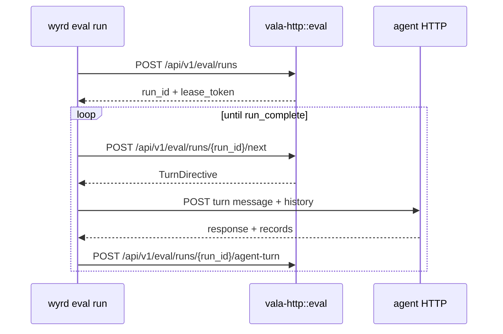

# Running evals

## Three ways to run

| Flow | Use when | Orchestrator | HTTP dependency |
|---|---|---|---|
| `wyrd eval run --local --agent-url URL` | You want local agent-driving with the full state machine | `EmbeddedOrchestrator` in the CLI process | Agent URL only |
| `wyrd eval run --local --records PATH` | You want to replay JSONL `EvalRecord` rows against the spec | None, scoring engine only | None |
| `wyrd eval run --server URL --agent-url AGENT` | You want a shared `wyrd-server` to own run state | `EmbeddedOrchestrator` in `wyrd-server` | `vala-http::eval` and agent URL |

All three flows load an Eval card from `--eval`. Local agent-driving and server
runs also load scenarios from `--scenarios`. Record replay loads
`EvalRecordObservation` JSONL from `--records`.

## `--local --agent-url` walk-through

1. CLI loads the Eval card and scenario collection.
2. CLI validates the `EvalSpec` and builds a judge invoker.
3. CLI creates `EmbeddedOrchestrator` in-process.
4. The orchestrator opens run state for the scenario list.
5. For each `agent_turn`, CLI posts `{ message, history }` to `--agent-url`.
6. The agent response and emitted records return to the orchestrator.
7. The orchestrator scores scenarios, aggregates `EvalResults`, writes output,
   and applies the pass gate.

## `--local --records` walk-through

1. CLI loads the Eval card.
2. CLI reads JSONL records from `--records`.
3. CLI builds the scoring engine without an orchestrator.
4. Each record is scored against the task DAG.
5. Results aggregate directly into one `EvalResults` artifact.
6. Optional `--baseline` comparison writes `comparison.json`.
7. The pass gate controls exit code when `--fail-on-gate` is enabled.

Use this flow for CI replay, trace replay, and fast iteration when you already
have records from a prior run.

## `--server --agent-url` walk-through

1. CLI loads the Eval card and posts `POST /api/v1/eval/runs` to the server.
2. Server returns `run_id` and `lease_token`.
3. CLI loops on `POST /api/v1/eval/runs/{run_id}/next` with the bearer lease.
4. On `agent_turn`, CLI calls `--agent-url`.
5. CLI posts the response and records to
   `POST /api/v1/eval/runs/{run_id}/agent-turn`.
6. On `user_turn_needed`, CLI posts a scripted client user turn when running
   in client mode.
7. On `run_complete`, CLI exits. Results remain server-side in v1.

## `--judge-mock`

`--judge-mock` uses `MockJudgeInvoker` and avoids provider credentials. The
CLI requires this for local flows when an Eval spec contains `LlmJudgeTask`
and no production judge should be called. It is the default choice for
credential-free CI.

## Baselines and exit codes

`--baseline path.json` loads a previous `EvalResults` artifact and runs the
comparison engine against the current run. Local flows write `results.json`,
`SUMMARY.json`, and, when a baseline is present, `comparison.json` under
`--out` or `.wyrd/eval/<run_id>/`.

Pass-gate failure exits with code `2` when `--fail-on-gate` is enabled. Server
protocol runs complete with `0` because v1 does not fetch server-side results
back to the CLI.

## Outputs

Local outputs are JSON artifacts. `results.json` is the canonical
`EvalResults` payload. `SUMMARY.json` currently mirrors the same payload for
human-oriented tooling. `comparison.json` is present only when `--baseline` is
provided. See [Results and comparison](/evaluation/results-and-comparison/)
for the field layout.
