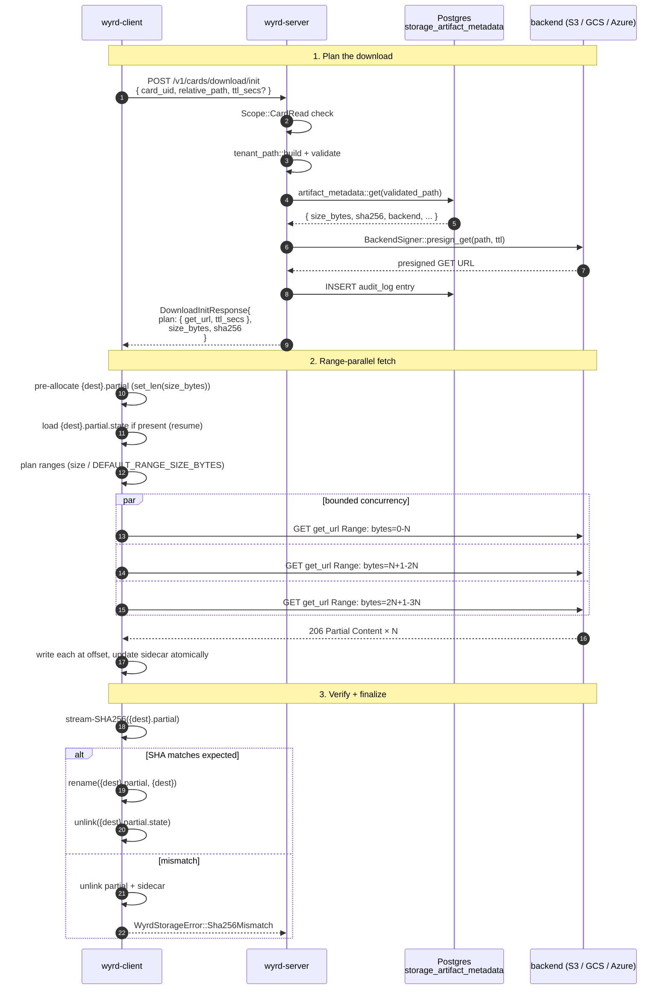
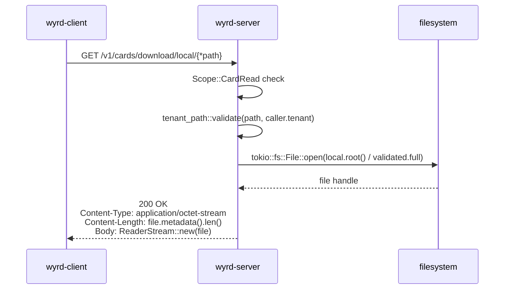

Downloads are simpler than uploads. The server mints one presigned GET
URL; the client drives bytes with HTTP range parallelism and a
`.partial.state` sidecar for resume.

| Method | Path | Service fn |
|---|---|---|
| POST | `/v1/cards/download/init` | `service::download_init` |
| GET | `/v1/cards/download/local/{*path}` | `service::download_local_blob` (Local-only) |

## End-to-end sequence (cloud backend)



## Local backend (no presign)

For Local-mode deployments the presigned URL would round-trip back to
the wyrd-server itself, so the server short-circuits and streams from
disk directly:



The route is only mounted when `backend = Local`; boot misconfiguration
fails fast with `WYRD_STORAGE_500_CONFIG_INVALID`.

## Range-parallel driver

The client driver in `wyrd-client::cards::loops::range_download` reads
the response, plans byte ranges based on
`DEFAULT_RANGE_SIZE_BYTES`, and issues bounded-concurrency GET requests
via `reqwest`. Each completed range writes at the correct offset of
`{dest}.partial` and atomically updates the sidecar.

```
{dest}.partial         ── pre-allocated to size_bytes via tokio File::set_len
{dest}.partial.state   ── serde_json with deny_unknown_fields:
                          { ranges_completed: [(start, end), ...],
                            sha256_expected: "...", size_bytes: N }
```

Atomic sidecar writes use `tempfile::NamedTempFile::persist` to avoid
torn writes. The sidecar is human-debuggable; downloads are not a
hot path (Q4).

## Resume

If the process crashes mid-download, the next `load` call sees
`{dest}.partial` and `{dest}.partial.state`, intersects
`ranges_completed` against the freshly-planned ranges, and only fetches
the missing pieces. Sidecar `sha256_expected` must match the new
`DownloadInitResponse`; mismatch aborts and starts fresh.

## SHA verification (client-side, this time)

Server-side verification happens at upload time (L17). Download
verification is client-side because the server already knows the bytes
are correct — the client wants to know the bytes-on-disk match what was
stored.

```rust
// wyrd-client::cards::loops::range_download (sketch)
let actual = stream_sha256(&partial_path).await?;
if actual != expected {
    fs::remove_file(&partial_path).await?;
    fs::remove_file(&sidecar_path).await?;
    return Err(WyrdStorageError::Sha256Mismatch { ... });
}
fs::rename(&partial_path, &dest_path).await?;
fs::remove_file(&sidecar_path).await?;
```

`stream_sha256` is the same `wyrd_storage::sha::stream_sha256` helper
the server-side fallback uses — one implementation, two callers.

## Errors

| Code | Status | Cause |
|---|---|---|
| `WYRD_STORAGE_400_TENANT_PATH_MISMATCH` | 400 | `relative_path` failed `tenant_path::validate` |
| `WYRD_STORAGE_400_SHA256_MISMATCH` | 400 | Client-side SHA differs from `DownloadInitResponse.sha256` |
| `WYRD_STORAGE_403_UPLOAD_FOREIGN_TENANT` | 403 | Local-blob path's first segment is another tenant |
| `WYRD_STORAGE_404_OBJECT_NOT_FOUND` | 404 | `artifact_metadata` returned None OR backend HEAD returned 404 |
| `WYRD_STORAGE_412_PRECONDITION` | 412 | If-Match failed during range fetch (source changed mid-download) |
| `WYRD_STORAGE_416_RANGE_NOT_SATISFIABLE` | 416 | Range past object length (source shrank) |
| `WYRD_STORAGE_503_PRESIGN_EXPIRED` | 503 | Presigned URL refused; client re-requests via `download_init` |
