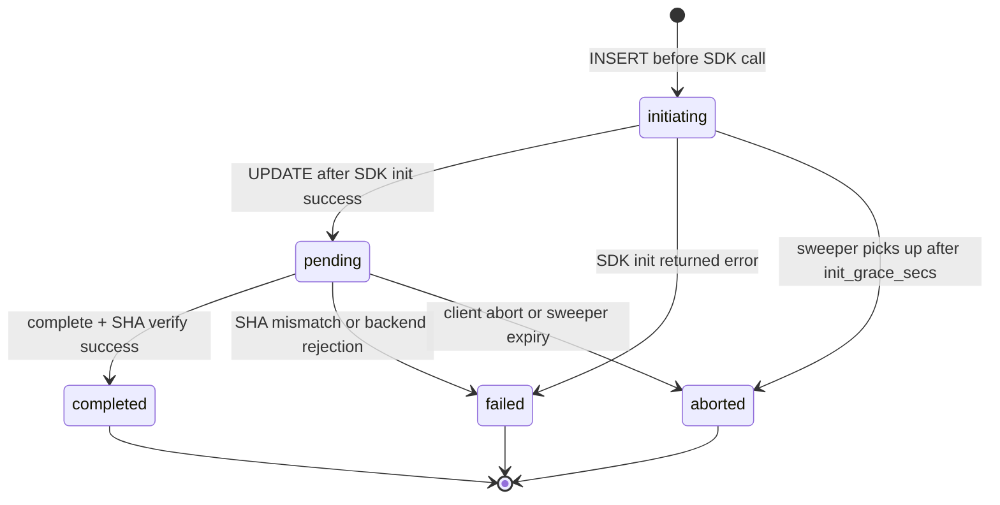

import { Aside } from "@astrojs/starlight/components";

Wyrd's storage subsystem owns durable card-artifact bytes across four
backends — Local, S3, GCS, Azure — behind a single server-side façade. The
client tier ships zero cloud SDKs; all credentialed work happens on the
server.

This spec covers the architecture and shared contracts. Per-flow diagrams
live in:

- [Upload flow](/tech-specs/storage/upload-flow/) — init → part-url → complete → abort, per backend
- [Download flow](/tech-specs/storage/download-flow/) — presign GET + range-parallel client driver
- [Lifecycle and error mapping](/tech-specs/storage/lifecycle/) — sweeper, idempotency reaper, error catalog

<Aside title="Plan source" data-variant="wyrd">
This spec distills `.dev/plan/foundations/04-storage/`. Every contract,
constant, and lock here is grounded in a numbered commit in that plan.
</Aside>

## Permanent locks

These are the invariants the rest of the spec is built on. Each one is
enforced by a `mise run check:*` grep at CI time.

| # | Lock | One-line statement |
|---|---|---|
| L1 | Rust-only foundation | No PyO3 in `wyrd-storage`, `wyrd-server::storage`, or `wyrd-client::artifacts`. |
| L2 | No bearer-token persistence | GCS session URIs, Azure SAS, and cloud single-PUT URLs never reach Postgres or in-memory server state. |
| L3 | No upload sidecar on the client | Client upload state is in-memory only; crash mid-upload re-runs `register`. |
| L4 | No per-part table | S3 ETags come up in the `complete` body; Azure block IDs are derived; GCS has none. |
| L5 | No batched presigns | One presigned URL per part, on demand. |
| L6 | `UploadPlan` is a closed tagged union | Adding a backend edits one enum. |
| L8 | Client ships zero cloud SDKs | `wyrd-client` depends only on `reqwest`, `sha2`, `tokio`, `wyrd-spec`, `url`, `serde`, `thiserror`, `tracing`, `base64`. |
| L9 | All durable writes via `TenantConn<'_>` | Tenancy enforced by Postgres RLS, not application code. |
| L11 | Single `Arc<dyn ObjectStore>` per process | Tenancy is path-prefix + RLS, not per-tenant stores. |
| L12 | No in-memory cross-request upload state | Every field `complete` reads lives on the `storage_multipart_uploads` row. |
| L13 | Init-row insert precedes backend SDK call | Two-phase init; sweeper picks up orphans. |
| L15 | Server-owned or server-verified completion | S3/Azure/Local finalize server-side; GCS resumable + cloud SinglePut are server-verified via HEAD + SHA. |
| L17 | Server-verified SHA-256 before `mark_completed` | Backend-supplied checksum is primary; streaming recompute is the fallback. |

The full L1–L17 table is in `.dev/plan/foundations/04-storage/00-README.md`.

## Component topology

Five Rust crates own this subsystem. The boundary between server-tier and
client-tier is a hard wall — cloud SDKs never cross it.

```
┌────────────────────────────── client tier (zero cloud SDKs, L8) ─────────────────────────────┐
│                                                                                              │
│   wyrd-client::cards::register / load                                                        │
│       ├── loops/single_put.rs       (PUT presigned URL)                                      │
│       ├── loops/s3_multipart.rs     (PUT presigned part URLs, collect ETags)                 │
│       ├── loops/gcs_resumable.rs    (PUT to resumable session URI in chunks)                 │
│       ├── loops/azure_block.rs      (PUT block IDs to SAS)                                   │
│       ├── loops/range_download.rs   (parallel GET with .partial.state resume)                │
│       └── artifacts/sidecar.rs      (download-only resume sidecar)                           │
│                                                                                              │
└──────────────────────────────────────── HTTP / problem+json ─────────────────────────────────┘
                                              │
                                              ▼
┌────────────────────────────── wyrd-server (axum, RLS-enforced) ──────────────────────────────┐
│                                                                                              │
│   storage::routes::mount(router) ──► storage::service::{                                     │
│       upload_init, upload_part_url, upload_complete, upload_abort,                           │
│       upload_local_blob, download_init, download_local_blob                                  │
│   }                                                                                          │
│                                                                                              │
│   AppState { pool, platform_admin_pool, storage: Arc<StorageHandle>, ... }                   │
│                                                                                              │
└────────────────────────────────────────────────────┬─────────────────────────────────────────┘
                                                     │
                  ┌──────────────────────────────────┼──────────────────────────────────┐
                  ▼                                  ▼                                  ▼
┌──────────────────────────────┐  ┌──────────────────────────────┐  ┌────────────────────────────┐
│ wyrd-storage  (server-tier)  │  │ wyrd-sql (TenantConn + RLS)  │  │  wyrd-spec::storage        │
│                              │  │                              │  │  (PyO3-free, L7)           │
│  StorageHandle               │  │  wyrd.storage_multipart_     │  │   UploadInitRequest        │
│   ├── BackendSigner          │  │       uploads                │  │   UploadInitResponse       │
│   │   ├── S3Signer           │  │  wyrd.storage_artifact_      │  │   UploadPlan  (tagged)     │
│   │   ├── GcsSigner          │  │       metadata               │  │   UploadCompleteRequest    │
│   │   ├── AzureSigner        │  │  wyrd.storage_access_ledger  │  │   UploadCompleteResponse   │
│   │   └── LocalSigner        │  │  wyrd.storage_idempotency_   │  │   DownloadInitRequest      │
│   ├── Arc<dyn ObjectStore>   │  │       keys                   │  │   DownloadInitResponse     │
│   │   (L11; one per process) │  │  queries::storage::*         │  │   StoredObjectRef          │
│   ├── sha::stream_sha256     │  │     (all take TenantConn)    │  │   UploadId, WireProtocol   │
│   └── sweeper::Sweeper       │  │  queries::storage::admin::*  │  │   StorageBackendKind       │
│       (Postgres advisory     │  │     (sweeper + reaper)       │  │                            │
│        lock leader election) │  │                              │  │                            │
└──────────────────────────────┘  └──────────────────────────────┘  └────────────────────────────┘
                  │                                  │
                  ▼                                  ▼
        ┌─────────────────┐                ┌────────────────┐
        │ Cloud / Local   │                │   Postgres     │
        │ object storage  │                │ (RLS on every  │
        │ (S3, GCS, Azure,│                │  storage_* row)│
        │  filesystem)    │                │                │
        └─────────────────┘                └────────────────┘
```

## Backend abstraction

`BackendSigner` is a closed enum (L6 variant). Adding a backend edits one
file:

```rust
// crates/wyrd/wyrd-storage/src/signer.rs
pub enum BackendSigner {
    Local(LocalSigner),
    S3(S3Signer),
    Gcs(GcsSigner),
    Azure(AzureSigner),
}

impl BackendSigner {
    pub fn kind(&self) -> StorageBackendKind { /* ... */ }
    pub async fn plan_upload(&self, /* ... */) -> Result<UploadPlan, StorageError>;
    pub async fn presign_part(&self, /* ... */) -> Result<String, StorageError>;
    pub async fn complete_server_side(&self, /* ... */) -> Result<(), StorageError>;
    pub async fn verify_sha256(&self, /* ... */) -> Result<(), StorageError>;
    pub async fn presign_get(&self, /* ... */) -> Result<String, StorageError>;
    pub async fn abort_multipart(&self, /* ... */) -> Result<(), StorageError>;
    pub async fn head_for_verification(&self, /* ... */) -> Result<HeadResult, StorageError>;
}
```

The signer holds the per-backend SDK client. The shared
`Arc<dyn object_store::ObjectStore>` lives next to it on `StorageHandle`
and is reused by DataFusion / Delta Lake reads (commit 10).

### Per-backend wire dispatch

`UploadPlan` is a tagged union. Each backend variant carries the bearer
state the client needs for that protocol, and only for that protocol.

| Backend | Plan variant | Multipart? | Server completion | SHA-256 source |
|---|---|---|---|---|
| Local | `LocalFsV1 { put_url }` | No | Server writes temp + fsync + rename | Streaming recompute |
| S3 (large) | `S3Multipart { upload_id, part_urls }` | Yes | Server `CompleteMultipartUpload` with persisted `upload_id` + client ETags | `x-amz-checksum-sha256` (backend) |
| S3 (small) | `SinglePutV1 { put_url }` | No | Client PUT is the commit; server HEAD + verify | Streaming recompute (fallback) |
| GCS | `GcsResumable { session_uri }` | Chunked PUT | Client finalizes; server HEAD + verify | `x-goog-hash` (backend) or recompute |
| Azure | `AzureBlock { sas, block_count }` | Yes | Server `PutBlockList` with derived block IDs | Streaming recompute |

Bearer pieces (`session_uri`, `sas`, presigned URLs) leave the server
exactly once in the `UploadInitResponse` and are never persisted (L2).

## Upload status state machine

Every multipart upload row passes through five states. The transitions
are enforced by SQL `CHECK` constraints (commit 04) and by the
two-phase init pattern (L13).



- `initiating` rows older than `WYRD_STORAGE_SWEEPER_INIT_GRACE_SECS` (default 30s, clamped 5–600) are orphan-sweep eligible (L13 / C2).
- `pending` rows past `expires_at` are TTL-sweep eligible.
- `completed`, `failed`, and `aborted` are terminal.

## What gets persisted vs. what doesn't

| State | Where it lives | Why |
|---|---|---|
| `upload_id` (Wyrd's ULID) | `wyrd.storage_multipart_uploads.id` | Stable identifier across crash/retry |
| `backend_upload_id` (S3) | Same row, column | Server needs it for `complete` (L12) |
| `block_count_planned` (Azure) | Same row, column | Deterministic block-ID derivation server-side |
| `wire_protocol` | Same row, column (TEXT round-trip of `WireProtocol`) | Dispatch in `complete` (L14) |
| `expected_size_bytes` | Same row, column | Verified post-upload via HEAD |
| `expected_sha256` | Same row, column | Verified by `BackendSigner::verify_sha256` (L17) |
| GCS `session_uri` | **Nowhere server-side** | Bearer-equivalent (L2); client finalizes |
| Azure `sas` | **Nowhere server-side** | Bearer-equivalent (L2); server uses credentialed `BlobClient` for `PutBlockList` |
| S3 presigned part URLs | **Nowhere** | Minted on demand per part (L5) |

The architectural payoff: `complete` is restart-safe, load-balancer-safe,
and replica-agnostic. Any wyrd-server replica can finalize any upload
because every piece of non-bearer state is on the durable row.

## Tenancy

One bucket, one backend, one shared `Arc<dyn ObjectStore>` per process
(L11). Tenancy is enforced two ways:

1. **Path prefix.** Every object path is
   `{data_tenant_id}/cards/{card_uid}/{relative_path}`. `wyrd_storage::tenant_path::validate(...)` rejects mismatched prefixes before any SDK call.
2. **Postgres RLS.** Every read and write to `wyrd.storage_*` goes through `TenantConn<'_>`, which sets `wyrd.current_tenant()` for the duration of the transaction. Cross-tenant reads return zero rows.

`StorageHandle::object_store_for(uri, caller_data_tenant_id)` validates
the URI's first path segment is a UUIDv7 matching the caller before
returning the shared store. Foreign-tenant access surfaces
`WYRD_STORAGE_403_UPLOAD_FOREIGN_TENANT`.

## Storage path layout

```
{data_tenant_id}/cards/{card_uid}/{relative_path}
└── UUIDv7 ─────┘ └ ULID ─────┘ └ caller-supplied (validated against [A-Za-z0-9._\-/], no `..`)
```

Example:

```
019234ab-cdef-7890-1234-567890abcdef/cards/01HZQX2K7VYNMG3FAW8/model.pt
```

The path is computed once in `tenant_path::build`, validated by
`tenant_path::validate`, and never reconstructed downstream.
