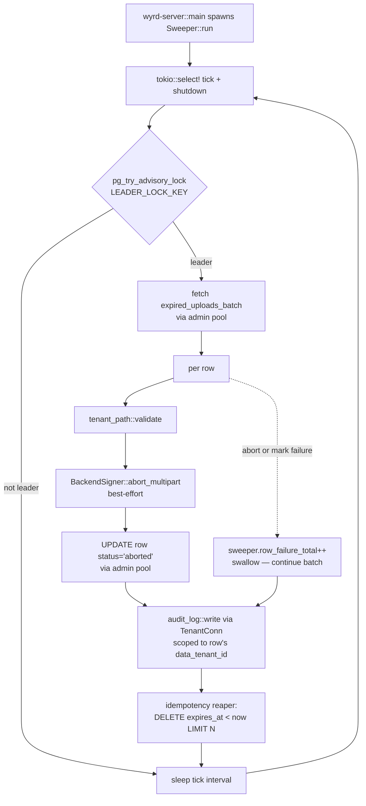

Three pieces of behavior run outside the request path:

- **Sweeper** — aborts expired multipart uploads, picks up orphaned `initiating` rows
- **Idempotency reaper** — drops expired entries from `wyrd.storage_idempotency_keys`
- **Error mapper** — single chain from backend SDK errors to HTTP problem+json

All three are owned by `wyrd-storage` and bolt into `wyrd-server` at boot.

## Sweeper

One in-process tokio task per wyrd-server replica. Leader election via
Postgres advisory lock makes multi-replica deployments safe (Q3).



### What's eligible

Per tick, the sweeper picks two row classes via
`expired_uploads_batch(pool, batch_size, init_grace)`:

| Status | Eligibility predicate | Why |
|---|---|---|
| `pending` | `expires_at < now()` | Presign window lapsed; client never finished |
| `initiating` | `created_at < now() - init_grace_secs` | Orphan from a failed two-phase init (L13 / C2) |

Both pass through the same abort + mark + audit path.

### Tunables

| Env var | Default | Range | Notes |
|---|---|---|---|
| `WYRD_STORAGE_SWEEPER_ENABLED` | `true` | bool | Set `false` in dev/test to inspect orphans |
| `WYRD_STORAGE_SWEEPER_TICK_SECS` | `60` | `[10, 3600]` | Loop interval |
| `WYRD_STORAGE_SWEEPER_BATCH_SIZE` | `100` | `[1, 1000]` | Rows per tick |
| `WYRD_STORAGE_SWEEPER_INIT_GRACE_SECS` | `30` | `[5, 600]` | Age for `initiating` rows |
| `WYRD_STORAGE_SWEEPER_IDEMPOTENCY_BATCH_SIZE` | `500` | `[1, 5000]` | Reaper cap (below) |

### Contract

Every state mutation the sweeper makes lands in the audit ledger. Every
per-row failure increments `sweeper.row_failure_total{backend, error_class}`. The sweeper never swallows a state mutation silently. A
backend abort that fails (network, permissions, deleted bucket) still
marks the row aborted in Postgres and still emits an audit entry — the
durable contract is the row, not the backend.

### Leader election

The advisory lock key is `0x57597264_53746f72` (`"WYrd_Stor"`). The lock
is held for the lifetime of the sweeper's dedicated connection. On
shutdown, dropping the connection releases the lock; another replica's
next tick acquires it.

```rust
pub const LEADER_LOCK_KEY: i64 = 0x57597264_53746f72;
```

## Idempotency reaper

The route-level idempotency seam in `upload_init` writes
`(key_hash, response_hash, expires_at, data_tenant_id)` rows to
`wyrd.storage_idempotency_keys` (commit 04). Without a reaper, that
table grows unbounded.

The reaper runs on the same sweeper tick, leader-only, after the
multipart sweep:

```sql
DELETE FROM wyrd.storage_idempotency_keys
WHERE expires_at < now()
RETURNING data_tenant_id
LIMIT $1;
```

The `LIMIT` keeps a runaway expiry queue from stalling the tick.
Reaper failure increments `sweeper.idempotency_reap_failure_total` and
is swallowed (the next tick retries). Per-row audit entries are **not**
emitted — idempotency keys are response-cache state, not durable
behavior.

## Error mapping chain

Errors cross three boundaries on the way from a backend SDK call to an
HTTP response. The chain is enforced by `mise run check:single-into-response-impl`, which fails CI on any
`impl IntoResponse for Wyrd*Error` beyond the canonical one in commit 00a.

```mermaid
flowchart LR
    SDK[Backend SDK error<br>e.g. aws_sdk_s3 error]
    S3E[S3Error / GcsError /<br>AzureError / LocalError<br>classified per-backend]
    SE[StorageError<br>classified union]
    WSE[WyrdStorageError<br>with wyrd_error derive]
    WE[WyrdError<br>via From&lt;WyrdStorageError&gt;]
    HTTP[axum Response<br>problem+json]

    SDK -->|S3Error::from_sdk(...)| S3E
    S3E -->|StorageError::from_storage_error(...)| SE
    SE -->|WyrdStorageError::from(StorageError)| WSE
    WSE -->|WyrdError::from(WyrdStorageError)| WE
    WE -->|IntoResponse for WyrdError<br>owned by commit 00a| HTTP
```

### Per-backend classification

`02-storage-handle.md` defines four per-backend error enums. Each one
classifies SDK errors into a small closed set the catalog can map
exhaustively:

```rust
pub enum S3Error {
    NoSuchKey { storage_path: String },
    LifecycleMissing,
    Throttled,
    Sdk(Box<aws_sdk_s3::Error>),
}

// GcsError, AzureError, LocalError follow the same shape.
```

The shared `StorageError` collects all four plus the cross-cutting
variants (`Sql`, `AdminPool`, `ConfigParse`, `BackendCapabilityMismatch`, `InvalidUri`, `TenantPrefixInvalid`, `TenantPrefixForeign`, `Sha256Mismatch`).

### Catalog (commit 09)

`WyrdStorageError` is the public catalog. Every variant carries
`#[wyrd_error(code, status, title, remediation)]`:

| Code | Status | Trigger |
|---|---|---|
| `WYRD_STORAGE_400_TENANT_PATH_MISMATCH` | 400 | path prefix ≠ caller's tenant |
| `WYRD_STORAGE_400_ARTIFACT_TOO_LARGE` | 400 | `expected_size_bytes > MAX_OBJECT_SIZE_BYTES` (5 TiB) |
| `WYRD_STORAGE_400_SHA256_MISMATCH` | 400 | computed SHA ≠ expected |
| `WYRD_STORAGE_400_INVALID_UPLOAD_ID` | 400 | `UploadId::from_str` failed or row not found |
| `WYRD_STORAGE_403_UPLOAD_FOREIGN_TENANT` | 403 | URI's tenant prefix ≠ caller |
| `WYRD_STORAGE_404_OBJECT_NOT_FOUND` | 404 | backend HEAD returned 404 |
| `WYRD_STORAGE_404_UPLOAD_NOT_FOUND` | 404 | `UploadId` not in `storage_multipart_uploads` |
| `WYRD_STORAGE_409_UPLOAD_NOT_PENDING` | 409 | complete / abort on terminal row OR dedup race |
| `WYRD_STORAGE_500_BACKEND` | 500 | classified SDK failure; retry MAY help |
| `WYRD_STORAGE_500_CONFIG_INVALID` | 500 | `StorageSettings` validation at boot |
| `WYRD_STORAGE_503_BACKEND_UNAVAILABLE` | 503 | backend 5xx / 429 / connection reset |
| `WYRD_STORAGE_503_PRESIGN_EXPIRED` | 503 | presigned URL refused by backend |

The full table is in `.dev/plan/foundations/04-storage/00-README.md §"Error codes"`.

### Single response mapper

Only one `impl IntoResponse for WyrdError` exists in the tree, in
`wyrd-server::error` (commit 00a):

```rust
// crates/wyrd/wyrd-server/src/error.rs
impl IntoResponse for WyrdError {
    fn into_response(self) -> Response {
        let status = StatusCode::from_u16(self.status())
            .unwrap_or(StatusCode::INTERNAL_SERVER_ERROR);
        (status, Json(self.to_problem_json())).into_response()
    }
}

impl From<WyrdStorageError> for WyrdError {
    fn from(e: WyrdStorageError) -> Self {
        WyrdError::Storage(e)
    }
}
```

No `ApiError` wrapper. No storage-specific response mapper. CI gate
`check:single-into-response-impl` greps for any second
`impl IntoResponse for Wyrd*Error` and fails on more than one.

## Observability

Counters surfaced by this subsystem:

| Metric | Labels | Increment on |
|---|---|---|
| `sweeper.row_failure_total` | `backend`, `error_class` | per-row abort or mark failure |
| `sweeper.idempotency_reap_failure_total` | — | reaper SQL failure |
| `storage.upload_init_total` | `backend`, `outcome` | every init terminal outcome |
| `storage.upload_complete_total` | `backend`, `outcome` | every complete terminal outcome |
| `storage.sha_mismatch_total` | `backend` | server-verified SHA mismatch |

Every public handler is `#[tracing::instrument(...)]` with structured
fields (`upload_id`, `backend`, `tenant`, `scope`). Spans flow through
the request-id middleware in commit 00a.
