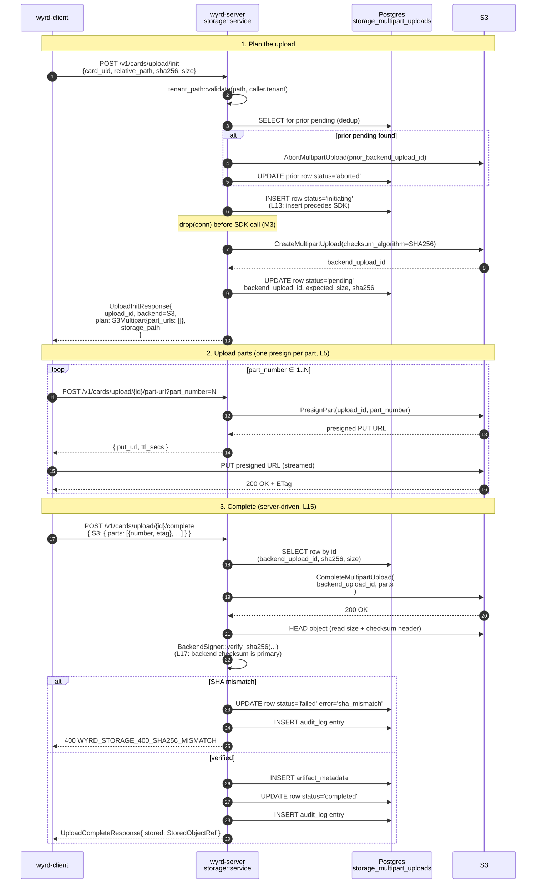
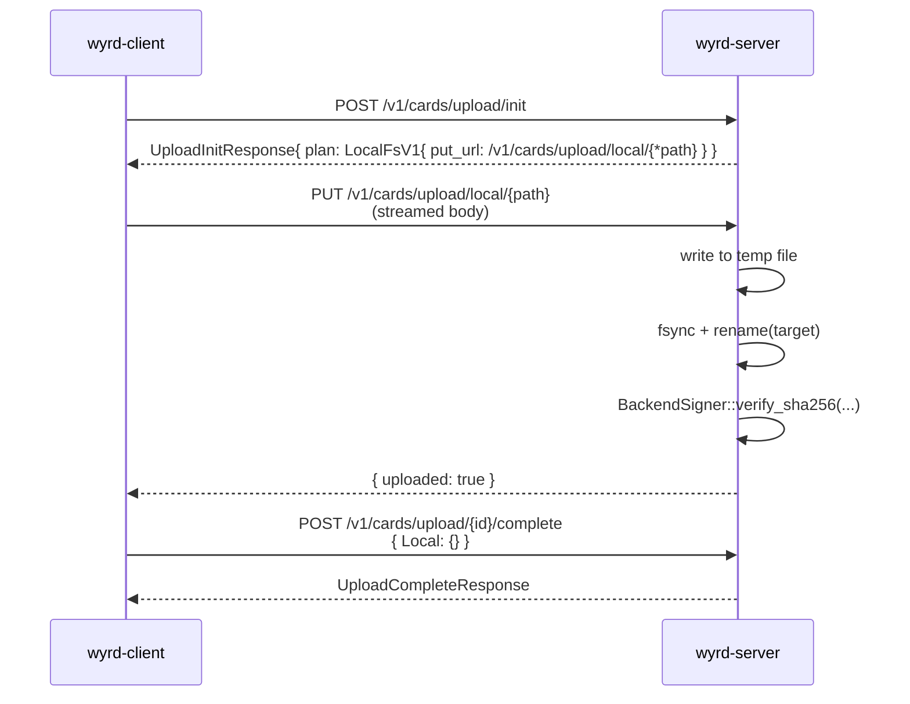
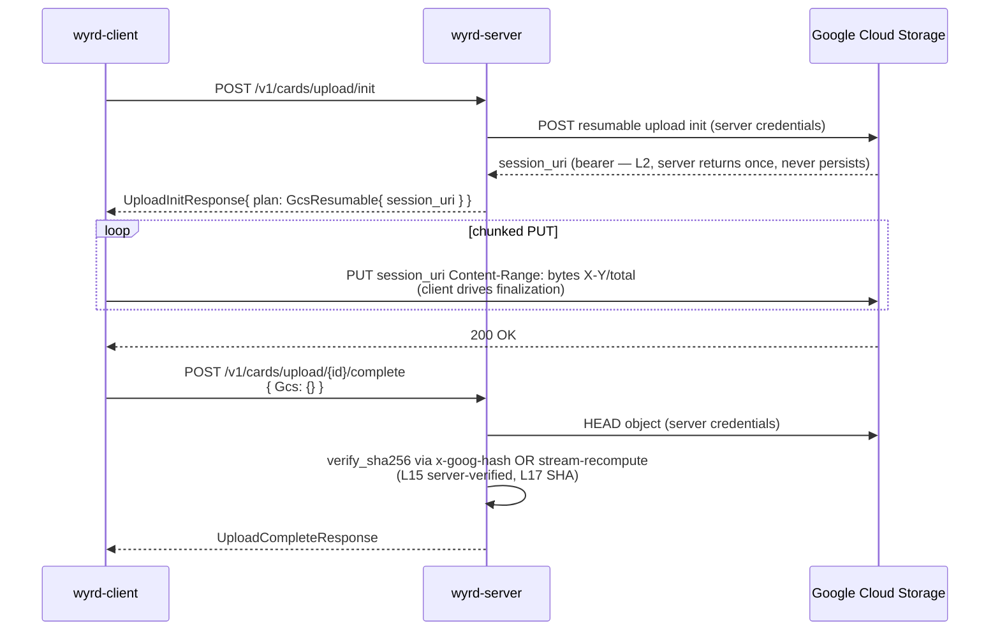
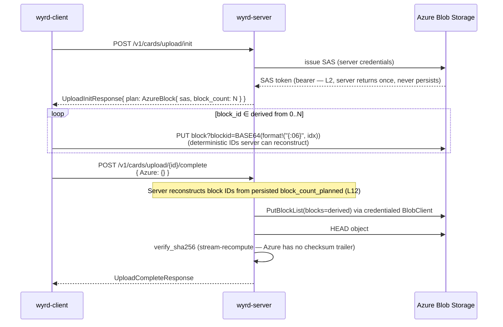
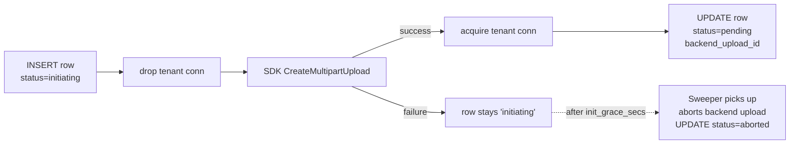
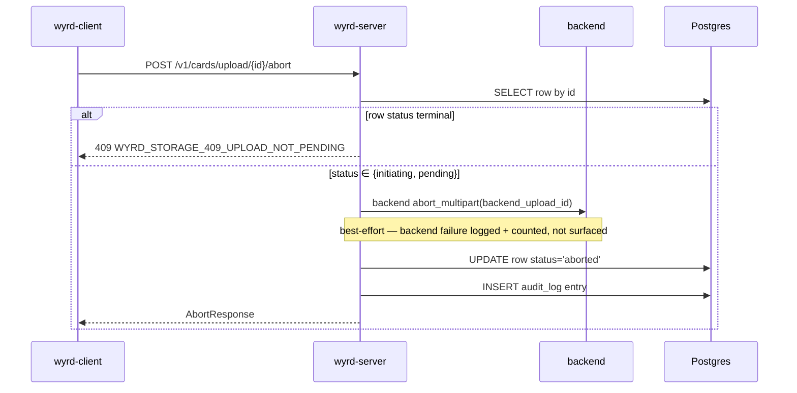

The upload surface is four routes plus one Local-only blob writer. Each
service function is a pure `async fn(&AppState, Caller, Request) -> Result<Response, WyrdError>`
that's testable without axum.

| Method | Path | Service fn |
|---|---|---|
| POST | `/v1/cards/upload/init` | `service::upload_init` |
| POST | `/v1/cards/upload/{id}/part-url?part_number=N` | `service::upload_part_url` |
| POST | `/v1/cards/upload/{id}/complete` | `service::upload_complete` |
| POST | `/v1/cards/upload/{id}/abort` | `service::upload_abort` |
| PUT  | `/v1/cards/upload/local/{*path}` | `service::upload_local_blob` |

## End-to-end sequence (S3 multipart, the canonical case)



## Per-backend deltas

The init / part / complete shape is the same. The bytes-on-the-wire and
the server's commit step differ.

### Local (filesystem)



### GCS resumable



### Azure block blob



## Two-phase init (L13)

The `initiating → pending` split closes a race where the SDK
`CreateMultipartUpload` succeeds but the server crashes before persisting
the `backend_upload_id`. Without two-phase init, that crash would leak a
backend upload with no row to track it.



The connection drops between step (1) and step (3) because the SDK call
is the slow path; holding a Postgres connection across it would burn pool
slots under load (M3).

## Re-init dedup

If a client re-runs `register` after a crash, the second `upload_init`
with the same `(card_uid, expected_sha256)` finds the prior pending row.
The service:

1. Aborts the prior backend upload via `BackendSigner::abort_multipart`.
2. Marks the prior row `aborted`.
3. Issues a fresh `UploadId` and starts over.

A rare race — two concurrent `upload_init` calls — can both pass
`find_pending_for_dedupe` while both rows are still `initiating`. The
partial unique index on `(data_tenant_id, card_uid, expected_sha256) WHERE status = 'pending'` catches them at `mark_pending` time. The
second caller's UPDATE hits `UniqueViolation` and the service returns a
409 with documented remediation: "retry the upload; the first caller's
pending plan is already live."

This is a **409, not a 500**.

## SHA-256 verification matrix (L17)

`BackendSigner::verify_sha256(path, expected, head_hint)` runs after HEAD
and before `mark_completed`. The primary source is the backend-supplied
checksum where available; streaming recompute is the fallback.

| Backend | Primary | Fallback |
|---|---|---|
| S3 | `x-amz-checksum-sha256` (set via `ChecksumAlgorithm::SHA256` on `CreateMultipartUpload`) | `wyrd_storage::sha::stream_sha256` |
| GCS | `x-goog-hash` from HEAD response | `wyrd_storage::sha::stream_sha256` |
| Azure | — (no trailer support on the standard PUT path) | `wyrd_storage::sha::stream_sha256` |
| Local | — | `wyrd_storage::sha::stream_sha256` |

Mismatch fails closed:

```rust
mark_failed(&mut conn, upload_id, "sha_mismatch").await?;
return Err(WyrdStorageError::Sha256Mismatch { ... });
```

## Abort path



The abort is best-effort against the backend because the durable
contract is the row state. A backend abort failure is logged and bumps
`sweeper.row_failure_total{backend, error_class}`; the next sweeper tick
picks it up (or a future re-init dedup does).

## Idempotency (route-level)

`upload_init` accepts an idempotency key in the request body (not a
header — bearer-free, L2). The first call writes `(key, response_hash, expires_at)` to `wyrd.storage_idempotency_keys` and returns. Repeats
within the TTL replay the cached response without touching the backend.

The reaper that cleans expired keys is part of the storage sweeper —
see [Lifecycle](/tech-specs/storage/lifecycle/).

## Authz

Every upload route gates on `Scope::CardWrite`. Failures return
`WyrdError::InsufficientScope` directly (not through any storage-specific
mapper). The single `IntoResponse for WyrdError` impl in
`wyrd-server::error` (commit 00a) renders both `WyrdError` and lifted
`WyrdStorageError` into the same problem+json envelope.
